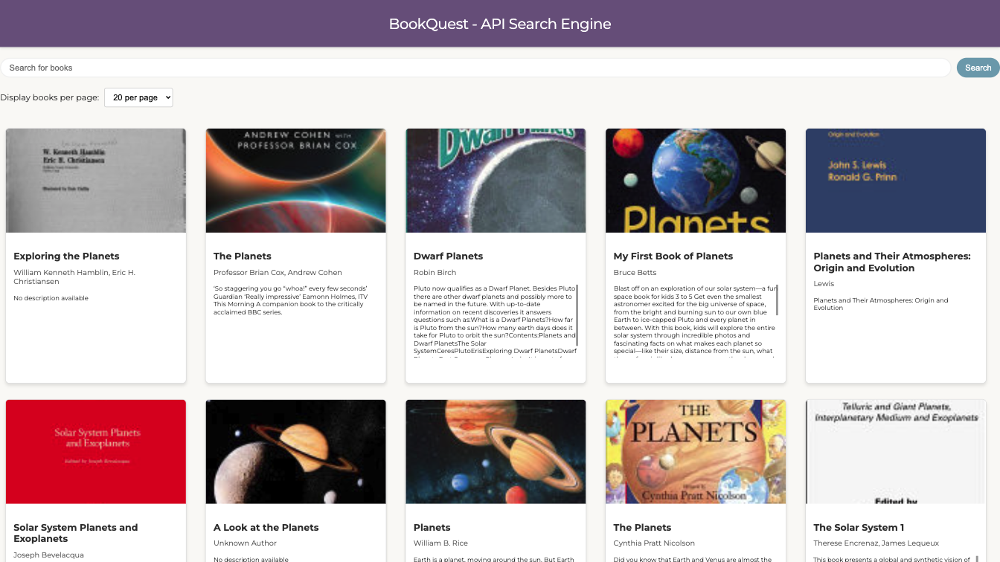

# BookQuest - Google Books API Search Engine


## Project Overview
This application is an interactive platform built with React where users can search for books in the Google Books database and view detailed information about each title.


## Deployment Link
This Search Engine is live! Check it out [here](https://bookquest-api-search-engine.netlify.app/).


## Screenshots


## Table of Contents
- [Goals & MVP](#goals--MVP)
- [Tech Stack](#tech-stack)
- [Build Steps](#build-steps)
- [Project Features](#project-features)
- [Additions & Improvements](#additions--improvements)
- [Learning Highlights](#learning-highlights)
- [Challenges](#challenges)

## Goals & MVP
The main objective is to provide a responsive, user-friendly interface for book enthusiasts to explore books and get comprehensive details via the Google Books API.


## Tech Stack
- HTML
- CSS/SCSS
- JavaScript 
- React
- Git
- Google Books API


## Build Steps
1. Clone the project from GitHub:
   ```bash
   git clone git@github.com:cyberforge1/google-books-api-search-engine.git

9. Run the application locally:
    ```bash
    npm run dev
    ```

## How To Use
Type a subject, author, title, or other book information into the search bar and click the search button to find specific information that matches these fields.


## Project Features
- [x] Sends queries to the Google Books API to search for books and retrieve specific information
- [x] A randomized query sent when entering the website 
- [x] Pagination of data returned 
- [x] Interactive modals to display specific data


## Additions & Improvements
- [ ] Addition of a search results for " " and number of results
- [ ] Create a series of API calls to fetch all results 
- [ ] Refined styling of header and button components
- [ ] Addition of footer with social media icons
- [ ] Scale up image quality
- [ ] Add pointer / integrate zambia modal 


## Learning Highlights
This project highlighted the importance of asynchronous programming in React and the effective use of API data to enhance user interfaces.


## Challenges
- Creating a modal that would close when anywhere else in the application was clicked
- Implementing a series of API calls to collect all associated data

## Contact Me
- Visit my [LinkedIn](https://www.linkedin.com/in/obj809/) for more details.
- Check out my [GitHub](https://github.com/cyberforge1) for more projects.
- Or send me an email at obj809@gmail.com
<br />
Thanks for your interest in this project. Feel free to reach out with any thoughts or questions.
<br />
<br />
Oliver Jenkins © 2024
